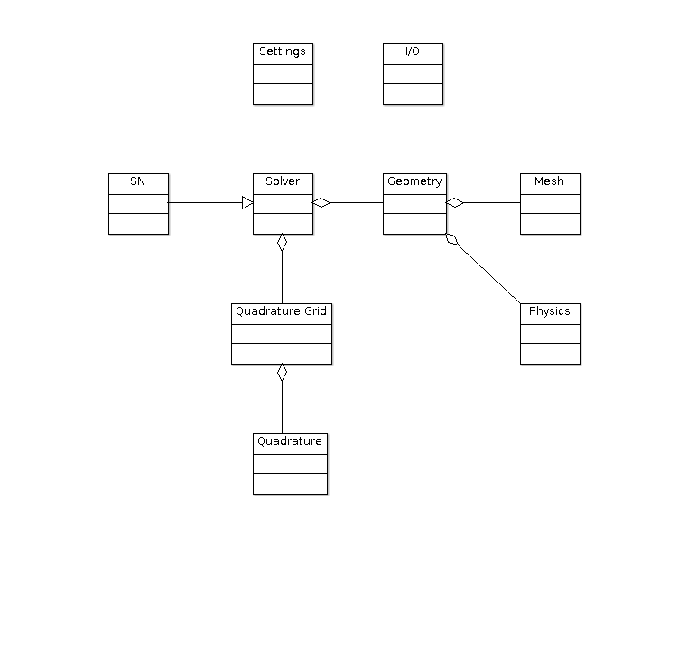

# RTSN - a HPC Radio Tomography $`S_n`$ framework
TBD 
## What RTSN is capable of
### Theory
TBD
### Examples
TBD

## Build
### System dependencies
 - Compiler with C++17 support (GCC >= v6, clang >= v3.8)
 - cmake >= v3.5
 - LAPACK
 - OpenMP
 - MPI
 - git
 - ninja or make

### Obtain submodules
Note that an **active internet connection is required for the first build** in order to download the latest versions of the required submodules!
For the first build only, download all submodules:

```bash
git submodule init
git submodule update
```

### Compile
**Make** build system (available on most systems)
 
```bash 
cd code/build/release
cmake -DCMAKE_BUILD_TYPE=Release ../../
make 
```
If building in parallel is desired, change the last line to `make -jN`, where `N` optimally is equal to the number of available threads+1.

**Ninja** build system:

```bash 
cd code/build/release
cmake -G Ninja -DCMAKE_BUILD_TYPE=Release ../../
ninja
```


The resulting executable will automatically be placed in the `code/bin` folder.
 
## Run
### Local
Execute the compiled binary and hand over a valid *TOML*-styled config file.
Example:

```bash
./bin/RTSN input/example.toml
```

In order to run the code in parallel execute:

```bash
OMP_NUM_THREADS=N mpirun -np J ./bin/RTSN input/example.toml
```

with `N` equal to the number of shared memory threads and `J` equal to the number of distrubuted memory threads.

### BwUniCluster
TBD

## Code structure

<br/><br/>
The diagram can be modified by opening `doc/uml.zargo` with `ArgoUML`.

## Coding style
Please stick to the following coding style for easier code readability:

 - class variables start with an underscore and lowercase letters e.g. `_foo`
 - functions start with a capital letter e.g. `GetSettings()`
 - any variable/function names have capital letters at each individual word e.g. `GetAllCellsAdjacentTo(Cell i)`

Please also use the provided `code/.clang-format` style format to format your code before pushing your latest commits.
Some editors offer to automatically apply the style format upon saving a file (e.g. `Qtcreator`).
