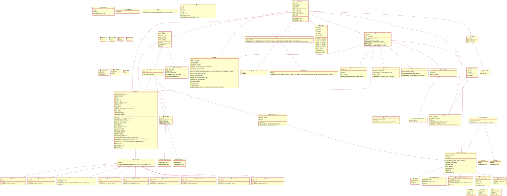

[](https://github.com/CSMMLab/KiT-RT/actions/workflows/c-cpp.yml)
[](https://coveralls.io/github/CSMMLab/KiT-RT?branch=master)
[](https://kit-rt.readthedocs.io/en/latest/?badge=latest)
[](https://opensource.org/licenses/MIT)

# KiT-RT - an HPC Radio Therapy simulation framework
The KiT-RT (Kinetic Transport Solver for Radiation Therapy) framework is a high-performance open source platform for radiation transport. Its main focus is on radiotherapy planning in cancer treatment. To enable problem-specific method selection, the framework provides different deterministic solver types. This not only facilitates treatment planning, but also provides tools to investigate various research questions in the field of radiative transfer. This goal is supported by an easily extendable code structure that allows for straightforward implementation of additional methods and techniques.

The documentation can be found [here](https://kit-rt.readthedocs.io/en/develop/index.html). 
## What KiT-RT is capable of
### Theory
A short description of kinetic theory can be found [here](https://kit-rt.readthedocs.io/en/develop/physics.html).

## Build
### Required dependencies
 - Compiler with C++17 support
 - cmake >= v3.12.4
 - LAPACK
 - OpenMP
 - MPI
 - VTK
 - git
 - ninja or make
 - gmsh

### Python dependencies
- pygmsh version 6.1.1 
```bash
  pip install pygmsh==6.1.1
```
 (note that newer versions are not yet supported)


### Obtain submodules
Note that an **active internet connection is required for the first build** in order to download the latest versions of the required submodules!
For the first build only, download all submodules:

```bash
git submodule update --init --recursive
```

### Compile the code
**Make** build system (available on most systems)
 
```bash 
cd code/build/release
cmake -DCMAKE_BUILD_TYPE=Release ../../
make 
```
If building in parallel is desired, change the last line to `make -jN`, where `N` optimally is equal to the number of available threads+1.

**Ninja** build system:

```bash 
cd code/build/release
cmake -G Ninja -DCMAKE_BUILD_TYPE=Release ../../
ninja
```


The resulting executable will automatically be placed in the `code/bin` folder.

---

## Run
### Local
Execute the compiled binary from the `bin` folder and hand over a valid *TOML*-styled config file.
Example from inside the `code` directory:

```bash
./KiT-RT ../input/example.cfg
```

In order to run the code in parallel execute:

```bash
OMP_NUM_THREADS=N mpirun -np J ./KiT-RT ../input/example.cfg
```

with `N` equal to the number of shared memory threads and `J` equal to the number of distrubuted memory threads.

### BwUniCluster
As VTK is not available on the bwUniCluster, it needs to be installed first. This just needs to be done once. Example:
```bash
module load devel/cmake/3.16
module load compiler/gnu/9.2
wget --no-check-certificate --quiet https://www.vtk.org/files/release/8.2/VTK-8.2.0.tar.gz
tar xzf VTK-8.2.0.tar.gz 
mkdir VTK-build
cd VTK-build
cmake -DCMAKE_BUILD_TYPE=Release -DBUILD_DOCUMENTATION=OFF -DBUILD_TESTING=OFF -DCMAKE_INSTALL_PREFIX=~/VTK-install ../VTK-8.2.0
make -j
make install
cd -
rm -r VTK-8.2.0 VTK-build
```

Example for build and run on bwUniCluster:
Get the code
```bash
git clone https://git.scc.kit.edu/rtsn/rtsn.git KiT-RT
cd KiT-RT/
git submodule init
git submodule update
```
Append `HINTS VTK_INSTALL_DIR` to the `find_package( VTK ... )` line in the CMakeLists.txt. E.g.:
```bash
find_package( VTK REQUIRED COMPONENTS vtkIOGeometry vtkFiltersCore HINTS ~/VTK-install )
```

Compile it (make sure you use GCC as compiler: module load compiler/gnu/10.2) 
```bash
module load devel/cmake/3.16
module load compiler/gnu/9.2
module load mpi/openmpi/4.0
cd code/build/release/
cmake -DCMAKE_BUILD_TYPE=Release ../../
make -j
```

---

## Tests
After compiling the framework as described above just run:

```bash
make test
```

The `unit_tests` executable will also be placed in in the build folder.

## Continuous Integration (CI)
Every commit on the master branch will trigger a build test and unit tests.
If either of the tests fail you will get an email, telling you the 'pipeline' has failed. If this happens, visit the 'CI/CD' tab and check what went wrong and try to fix the error as soon as possible.
Creating a merge request from a branch into the master branch will (not tested yet) also trigger the tests and your merge will be rejected in case any test fails.
As a temporary solution, these tests will currently be done on a low power virtual machine running on a 24/7 online PC at Jannick's place (i.e. don't create computationally expensive tests right now as they will fail if exceeding 1GB of memory).
If you add additional libraries to the code, these also need to be added to the test environment, i.e. the respective docker container.
Little guide:
Test the library installation in the docker container
```bash
docker run -it --rm rtsn/test:latest bash
```
Note the steps required and add them to the `Dockerfile` in the `scripts` folder.
Build the new container (takes some time)
```bash
cd docker build -t rtsn/test:latest .
```
or commit your changes to the image (google that procedure).
Push the new image to `hub.docker.com`
```bash
docker push rtsn/test:latest
```
This last step requires a preceeding `docker login`. Ask Jannick for login credentials.

---

## Code structure
**WARNING: is not created automatically - might be out of date!**
Reverse engineered plantuml diagram of the current code structure: 

<br/><br/>
Was created using [hpp2plantuml](https://github.com/thibaultmarin/hpp2plantuml) and [plantuml](https://plantuml.com/), e.g.:
```bash
cd doc 
hpp2plantuml -i "../code/include/*.h" -i "../code/include/*/*.h" -o uml.puml
plantuml uml.puml -tsvg
```

---

## Coding style
Please stick to the following coding style for easier code readability:

 - class variables start with an underscore and lowercase letters e.g. `_foo`
 - functions start with a capital letter e.g. `GetSettings()`
 - any variable/function names have capital letters at each individual word e.g. `GetAllCellsAdjacentTo(Cell i)`
 - Abstract base classes for inheritance structures end with the suffix "Base" e.g. QuadratureBase, whith child classes 
   QGaussLegendre or QProduct

Please also use the provided `.clang-format` style format to format your code before pushing your latest commits.
Some editors offer to automatically apply the style format upon saving a file (e.g. `Qtcreator`).
